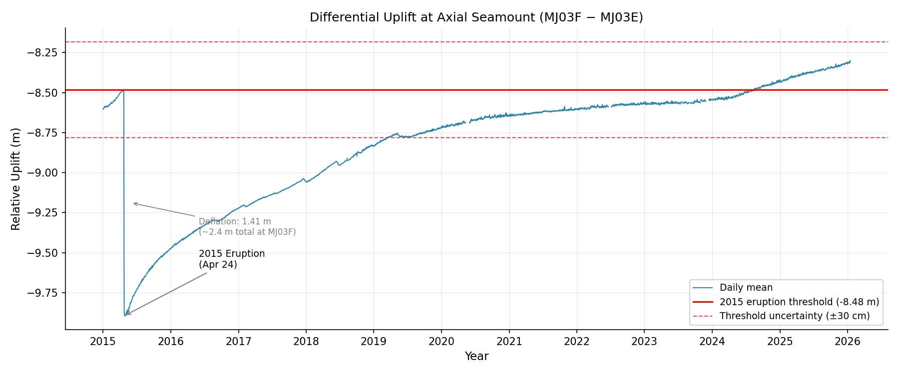

# Axial Seamount Differential Uplift Analysis

Calculating volcanic deformation at Axial Seamount using Bottom Pressure Recorder (BPR) data from the Ocean Observatories Initiative (OOI) Cabled Array.

## Overview

This project analyzes differential uplift between two BPR stations at Axial Seamount, an active submarine volcano on the Juan de Fuca Ridge. By comparing pressure measurements from two locations within the caldera, we isolate volcanic deformation from oceanographic signals.

**Key Result:** The analysis reveals ~11 years of volcanic inflation following the April 2015 eruption, with the caldera now exceeding its pre-eruption level by ~20 cm.



## Stations

| Station | Location | Description |
|---------|----------|-------------|
| MJ03E | Eastern Caldera | Reference station |
| MJ03F | Central Caldera | Near the eruptive vent |

The differential signal (MJ03E − MJ03F) shows relative vertical displacement between these two points, removing common-mode signals like ocean tides and atmospheric pressure.

## Quick Start

```bash
# Clone the repository
git clone https://github.com/daxsoule/my-analysis_botpt.git
cd my-analysis_botpt

# Install dependencies
pip install -r requirements.txt

# Run the analysis
python analysis.py
```

## Outputs

### Data Products

| File | Description |
|------|-------------|
| `outputs/data/differential_uplift_hourly.parquet` | Hourly cleaned data (92,222 rows) |
| `outputs/data/differential_uplift_daily.parquet` | Daily averaged data (4,034 rows) |

**Columns:** `depth_mj03e_m`, `depth_mj03f_m`, `differential_m`

### Figures

- `outputs/figures/depth_mj03e.png` - Eastern Caldera depth time series
- `outputs/figures/depth_mj03f.png` - Central Caldera depth time series
- `outputs/figures/differential_uplift.png` - Differential uplift with 2015 eruption reference

## Quality Control

Spikes are removed using **Median Absolute Deviation (MAD)**, which is more robust to outliers than standard deviation:

1. Calculate 24-hour rolling median
2. Compute MAD (median of absolute deviations)
3. Flag points > threshold × 1.4826 × MAD
4. Replace flagged points with NaN

| Data | Threshold | Rationale |
|------|-----------|-----------|
| Individual stations | 5.0 | Conservative; catches obvious glitches |
| Differential signal | 3.5 | More aggressive; catches single-sensor spikes |

## Reproducible Notebook

For detailed methodology with full annotations, see the Jupyter notebook:

```bash
cd outputs/notebooks
conda env create -f environment.yml
conda activate axial-bpr-analysis
jupyter lab differential_uplift_analysis.ipynb
```

## Using the Data

```python
import pandas as pd

# Load daily differential uplift
bpr = pd.read_parquet('outputs/data/differential_uplift_daily.parquet')

# Join with other instruments
other = pd.read_parquet('path/to/other_data.parquet')
merged = bpr.join(other, how='inner')
```

## Project Structure

```
my-analysis_botpt/
├── analysis.py                     # Main analysis script
├── requirements.txt                # Python dependencies
├── outputs/
│   ├── constitution.pdf            # PDF reference document
│   ├── data/                       # Parquet data products
│   ├── figures/                    # PNG visualizations
│   └── notebooks/                  # Reproducible Jupyter notebook
└── .specify/
    ├── features/                   # Spec, plan, tasks
    └── memory/constitution.md      # Project constitution
```

## References

- Nooner, S. L., & Chadwick, W. W. (2016). Inflation-predictable behavior and co-eruption deformation at Axial Seamount. *Science*, 354(6318), 1399-1403.
- OOI Cabled Array: https://oceanobservatories.org/array/cabled-array/

## License

This analysis uses data from the Ocean Observatories Initiative, funded by the National Science Foundation.

## Author

Dax Soule
January 2026
